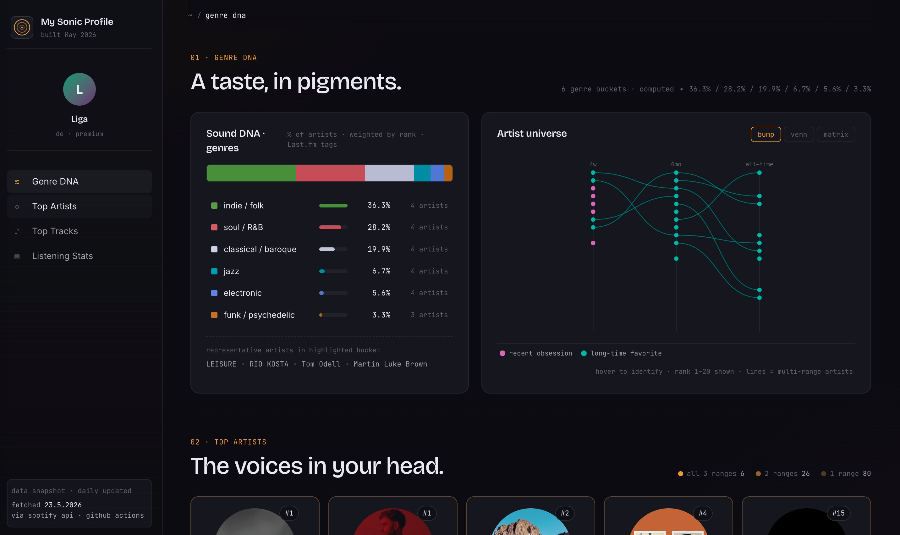

# Sonic

A personal Spotify stats portfolio — my listening data, visualized.



**[sonic.ligaauguste.de](https://sonic.ligaauguste.de)**

---

Sonic is a static React app — no backend, no login. Spotify data gets fetched daily by a Python script, converted into JS files, and committed to the repo. Vercel deploys automatically from there. The frontend itself is plain React with a single CSS file, no framework. State is just useState, no routing — everything scrolls on one page. Responsive layout is handled entirely through media queries, no JavaScript involved.

The interesting part: Spotify doesn't allow public API calls without a login — normally every visitor would need to authenticate to see any data. The workaround is fetching the data every morning at 06:00 UTC with my own account and storing it as a snapshot in the repo. Visitors see my real listening data without needing to log in themselves. Spotify also doesn't expose play counts and only returns the last 50 recently played tracks — so those get accumulated and deduplicated daily, building up meaningful stats over time.

One more thing worth noting: Spotify's genre data is notoriously sparse — the API returns empty genre arrays for the majority of artists. To get around that, every artist gets looked up via the Last.fm API, which has community-sourced tags that are actually useful. The result is then filtered (removing noise tags like "seen live" or "favorites") and the top 5 tags per artist are kept. That's where the Genre DNA section gets its data from — not Spotify, but Last.fm.

---

## What it shows

- **Genre DNA** — genre distribution across top artists, with an artist universe chart tracking movement across time ranges
- **Top Artists** — range tabs for last month, 6 months, and all time
- **Top Tracks** — with a "diverse" mode that filters duplicate albums
- **Listening Stats** — play counts, streak calendar, hourly patterns, and a Venn diagram of cross-range artists

## Stack

- **Frontend** — React + Vite, TypeScript, plain CSS
- **Data pipeline** — Python, Spotify API, Last.fm API (for genre enrichment)
- **Hosting** — Vercel
- **Updates** — GitHub Actions cron (daily at 06:00 UTC)

## Local setup

```bash
cd frontend
npm install
npm run dev
# → http://localhost:5174
```

To refresh data manually:

```bash
source .venv/bin/activate
python spotify_fetch.py
python genre_resolver.py spotify_data_*.json
python generate_data.py
```

Requires a `.env` with `SPOTIFY_CLIENT_ID`, `SPOTIFY_CLIENT_SECRET`, `SPOTIFY_REFRESH_TOKEN`, and `LASTFM_API_KEY`.

## About sonic.db

`sonic.db` is committed to the repo intentionally. It acts as the persistent store for the data pipeline — tracking every artist and track ever seen with a `first_seen_at` timestamp, and logging each daily fetch. The static JS files (`spotifyData.js`, `vennData.js`) are derived from it on every run.

Keeping it in git means the history survives across CI runs without needing an external database service. It grows slowly and is always regenerable from the raw Spotify snapshots.
